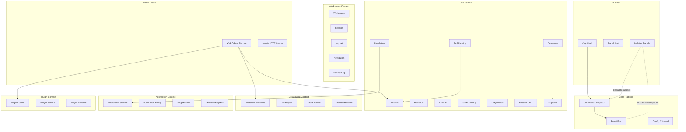

# cockpit-cli Target Architecture

Concrete Modular Monolith + Hexagonal + DDD light architecture, with module boundaries, folder structure, and phased migration.

---

## Bounded Contexts



---

## Module Definitions

### 1. Core Platform (`cockpit.core`)

Shared infrastructure that every context depends on. Stays thin.

| Current file | Target location |
|---|---|
| [application/dispatch/command_dispatcher.py](file:///home/damien/Dokumente/cockpit/src/cockpit/application/dispatch/command_dispatcher.py) | `core/dispatch/command_dispatcher.py` |
| [application/dispatch/command_parser.py](file:///home/damien/Dokumente/cockpit/src/cockpit/application/dispatch/command_parser.py) | `core/dispatch/command_parser.py` |
| [application/dispatch/event_bus.py](file:///home/damien/Dokumente/cockpit/src/cockpit/application/dispatch/event_bus.py) | `core/dispatch/event_bus.py` |
| [application/handlers/base.py](file:///home/damien/Dokumente/cockpit/src/cockpit/application/handlers/base.py) | `core/dispatch/handler_base.py` |
| [domain/commands/command.py](file:///home/damien/Dokumente/cockpit/src/cockpit/domain/commands/command.py) | `core/command.py` |
| [domain/events/base.py](file:///home/damien/Dokumente/cockpit/src/cockpit/domain/events/base.py) | `core/events/base.py` |
| [domain/events/runtime_events.py](file:///home/damien/Dokumente/cockpit/src/cockpit/domain/events/runtime_events.py) | `core/events/runtime.py` |
| [shared/enums.py](file:///home/damien/Dokumente/cockpit/src/cockpit/shared/enums.py) | `core/enums.py` |
| [shared/config.py](file:///home/damien/Dokumente/cockpit/src/cockpit/shared/config.py) | `core/config.py` |
| [shared/risk.py](file:///home/damien/Dokumente/cockpit/src/cockpit/shared/risk.py) | `core/risk.py` |
| [shared/types.py](file:///home/damien/Dokumente/cockpit/src/cockpit/shared/types.py) | `core/types.py` |
| [shared/utils.py](file:///home/damien/Dokumente/cockpit/src/cockpit/shared/utils.py) | `core/utils.py` |
| [infrastructure/persistence/sqlite_store.py](file:///home/damien/Dokumente/cockpit/src/cockpit/infrastructure/persistence/sqlite_store.py) | `core/persistence/sqlite_store.py` |
| [infrastructure/persistence/migrations.py](file:///home/damien/Dokumente/cockpit/src/cockpit/infrastructure/persistence/migrations.py) | `core/persistence/migrations.py` |
| [infrastructure/persistence/schema.py](file:///home/damien/Dokumente/cockpit/src/cockpit/infrastructure/persistence/schema.py) | `core/persistence/schema.py` |

### 2. Workspace Context (`cockpit.workspace`)

Session lifecycle, layout management, navigation.

| Current file | Target location |
|---|---|
| [application/services/workspace_service.py](file:///home/damien/Dokumente/cockpit/src/cockpit/application/services/workspace_service.py) | `workspace/services/workspace_service.py` |
| [application/services/session_service.py](file:///home/damien/Dokumente/cockpit/src/cockpit/application/services/session_service.py) | `workspace/services/session_service.py` |
| [application/services/layout_service.py](file:///home/damien/Dokumente/cockpit/src/cockpit/application/services/layout_service.py) | `workspace/services/layout_service.py` |
| [application/services/navigation_controller.py](file:///home/damien/Dokumente/cockpit/src/cockpit/application/services/navigation_controller.py) | `workspace/services/navigation_controller.py` |
| [application/services/activity_log_service.py](file:///home/damien/Dokumente/cockpit/src/cockpit/application/services/activity_log_service.py) | `workspace/services/activity_log_service.py` |
| [application/services/connection_service.py](file:///home/damien/Dokumente/cockpit/src/cockpit/application/services/connection_service.py) | `workspace/services/connection_service.py` |
| [application/handlers/workspace_handlers.py](file:///home/damien/Dokumente/cockpit/src/cockpit/application/handlers/workspace_handlers.py) | `workspace/handlers/workspace_handlers.py` |
| [application/handlers/session_handlers.py](file:///home/damien/Dokumente/cockpit/src/cockpit/application/handlers/session_handlers.py) | `workspace/handlers/session_handlers.py` |
| [application/handlers/layout_handlers.py](file:///home/damien/Dokumente/cockpit/src/cockpit/application/handlers/layout_handlers.py) | `workspace/handlers/layout_handlers.py` |
| [application/handlers/tab_handlers.py](file:///home/damien/Dokumente/cockpit/src/cockpit/application/handlers/tab_handlers.py) | `workspace/handlers/tab_handlers.py` |
| [domain/models/workspace.py](file:///home/damien/Dokumente/cockpit/src/cockpit/domain/models/workspace.py) | `workspace/models/workspace.py` |
| [domain/models/session.py](file:///home/damien/Dokumente/cockpit/src/cockpit/domain/models/session.py) | `workspace/models/session.py` |
| [domain/models/layout.py](file:///home/damien/Dokumente/cockpit/src/cockpit/domain/models/layout.py) | `workspace/models/layout.py` |
| [domain/events/domain_events.py](file:///home/damien/Dokumente/cockpit/src/cockpit/domain/events/domain_events.py) | `workspace/events.py` |
| [infrastructure/persistence/repositories.py](file:///home/damien/Dokumente/cockpit/src/cockpit/infrastructure/persistence/repositories.py) | `workspace/repositories.py` |
| [infrastructure/config/config_loader.py](file:///home/damien/Dokumente/cockpit/src/cockpit/infrastructure/config/config_loader.py) | `workspace/config_loader.py` |

### 3. Ops Context (`cockpit.ops`)

Incident management, self-healing, escalation, on-call, response orchestration, post-incident reviews. **This is the DDD-heaviest context.**

| Current file | Target location |
|---|---|
| [application/services/incident_service.py](file:///home/damien/Dokumente/cockpit/src/cockpit/application/services/incident_service.py) | `ops/services/incident_service.py` |
| [application/services/self_healing_service.py](file:///home/damien/Dokumente/cockpit/src/cockpit/application/services/self_healing_service.py) (42KB!) | `ops/services/self_healing_service.py` |
| [application/services/escalation_service.py](file:///home/damien/Dokumente/cockpit/src/cockpit/application/services/escalation_service.py) (38KB) | `ops/services/escalation_service.py` |
| [application/services/escalation_policy_service.py](file:///home/damien/Dokumente/cockpit/src/cockpit/application/services/escalation_policy_service.py) | `ops/services/escalation_policy_service.py` |
| [application/services/oncall_service.py](file:///home/damien/Dokumente/cockpit/src/cockpit/application/services/oncall_service.py) | `ops/services/oncall_service.py` |
| [application/services/oncall_resolution_service.py](file:///home/damien/Dokumente/cockpit/src/cockpit/application/services/oncall_resolution_service.py) | `ops/services/oncall_resolution_service.py` |
| [application/services/response_run_service.py](file:///home/damien/Dokumente/cockpit/src/cockpit/application/services/response_run_service.py) (36KB) | `ops/services/response_run_service.py` |
| [application/services/response_executor_service.py](file:///home/damien/Dokumente/cockpit/src/cockpit/application/services/response_executor_service.py) | `ops/services/response_executor_service.py` |
| [application/services/recovery_policy_service.py](file:///home/damien/Dokumente/cockpit/src/cockpit/application/services/recovery_policy_service.py) | `ops/services/recovery_policy_service.py` |
| [application/services/guard_policy_service.py](file:///home/damien/Dokumente/cockpit/src/cockpit/application/services/guard_policy_service.py) | `ops/services/guard_policy_service.py` |
| [application/services/operations_diagnostics_service.py](file:///home/damien/Dokumente/cockpit/src/cockpit/application/services/operations_diagnostics_service.py) | `ops/services/diagnostics_service.py` |
| [application/services/approval_service.py](file:///home/damien/Dokumente/cockpit/src/cockpit/application/services/approval_service.py) | `ops/services/approval_service.py` |
| [application/services/postincident_service.py](file:///home/damien/Dokumente/cockpit/src/cockpit/application/services/postincident_service.py) | `ops/services/postincident_service.py` |
| [application/services/runbook_catalog_service.py](file:///home/damien/Dokumente/cockpit/src/cockpit/application/services/runbook_catalog_service.py) | `ops/services/runbook_catalog_service.py` |
| [application/services/component_watch_service.py](file:///home/damien/Dokumente/cockpit/src/cockpit/application/services/component_watch_service.py) | `ops/services/component_watch_service.py` |
| [application/services/suppression_service.py](file:///home/damien/Dokumente/cockpit/src/cockpit/application/services/suppression_service.py) | *(→ notifications context)* |
| [application/handlers/escalation_handlers.py](file:///home/damien/Dokumente/cockpit/src/cockpit/application/handlers/escalation_handlers.py) | `ops/handlers/escalation_handlers.py` |
| [application/handlers/response_handlers.py](file:///home/damien/Dokumente/cockpit/src/cockpit/application/handlers/response_handlers.py) | `ops/handlers/response_handlers.py` |
| [domain/models/health.py](file:///home/damien/Dokumente/cockpit/src/cockpit/domain/models/health.py) | `ops/models/health.py` |
| [domain/models/escalation.py](file:///home/damien/Dokumente/cockpit/src/cockpit/domain/models/escalation.py) | `ops/models/escalation.py` |
| [domain/models/oncall.py](file:///home/damien/Dokumente/cockpit/src/cockpit/domain/models/oncall.py) | `ops/models/oncall.py` |
| [domain/models/response.py](file:///home/damien/Dokumente/cockpit/src/cockpit/domain/models/response.py) | `ops/models/response.py` |
| [domain/models/remediation.py](file:///home/damien/Dokumente/cockpit/src/cockpit/domain/models/remediation.py) | `ops/models/remediation.py` |
| [domain/models/review.py](file:///home/damien/Dokumente/cockpit/src/cockpit/domain/models/review.py) | `ops/models/review.py` |
| [domain/models/casefile.py](file:///home/damien/Dokumente/cockpit/src/cockpit/domain/models/casefile.py) | `ops/models/casefile.py` |
| [domain/models/policy.py](file:///home/damien/Dokumente/cockpit/src/cockpit/domain/models/policy.py) | `ops/models/policy.py` |
| [domain/models/watch.py](file:///home/damien/Dokumente/cockpit/src/cockpit/domain/models/watch.py) | `ops/models/watch.py` |
| [domain/models/diagnostics.py](file:///home/damien/Dokumente/cockpit/src/cockpit/domain/models/diagnostics.py) | `ops/models/diagnostics.py` |
| [domain/events/health_events.py](file:///home/damien/Dokumente/cockpit/src/cockpit/domain/events/health_events.py) | `ops/events/health.py` |
| [domain/events/escalation_events.py](file:///home/damien/Dokumente/cockpit/src/cockpit/domain/events/escalation_events.py) | `ops/events/escalation.py` |
| [domain/events/remediation_events.py](file:///home/damien/Dokumente/cockpit/src/cockpit/domain/events/remediation_events.py) | `ops/events/remediation.py` |
| [domain/events/response_events.py](file:///home/damien/Dokumente/cockpit/src/cockpit/domain/events/response_events.py) | `ops/events/response.py` |
| [infrastructure/persistence/ops_repositories.py](file:///home/damien/Dokumente/cockpit/src/cockpit.ops.repositories.py) (148KB!) | `ops/repositories/` *(split into files)* |
| [runtime/health_monitor.py](file:///home/damien/Dokumente/cockpit/src/cockpit/runtime/health_monitor.py) | `ops/runtime/health_monitor.py` |
| [runtime/escalation_monitor.py](file:///home/damien/Dokumente/cockpit/src/cockpit/runtime/escalation_monitor.py) | `ops/runtime/escalation_monitor.py` |
| [runtime/response_monitor.py](file:///home/damien/Dokumente/cockpit/src/cockpit/runtime/response_monitor.py) | `ops/runtime/response_monitor.py` |

> [!WARNING]
> [ops_repositories.py](file:///home/damien/Dokumente/cockpit/tests/integration/test_ops_repositories.py) at 148KB is the single largest file in the project. It should be split into cohesive files per aggregate: `incident_repos.py`, `escalation_repos.py`, `oncall_repos.py`, `response_repos.py`, `watch_repos.py`, etc.

### 4. Datasource Context (`cockpit.datasources`)

Database profiles, adapters, secret resolution, SSH tunneling.

| Current file | Target location |
|---|---|
| [application/services/datasource_service.py](file:///home/damien/Dokumente/cockpit/src/cockpit/application/services/datasource_service.py) | `datasources/services/datasource_service.py` |
| [application/services/secret_service.py](file:///home/damien/Dokumente/cockpit/src/cockpit/application/services/secret_service.py) (38KB) | `datasources/services/secret_service.py` |
| [application/handlers/db_handlers.py](file:///home/damien/Dokumente/cockpit/src/cockpit/application/handlers/db_handlers.py) | `datasources/handlers/db_handlers.py` |
| [domain/models/datasource.py](file:///home/damien/Dokumente/cockpit/src/cockpit/domain/models/datasource.py) | `datasources/models/datasource.py` |
| [domain/models/secret.py](file:///home/damien/Dokumente/cockpit/src/cockpit/domain/models/secret.py) | `datasources/models/secret.py` |
| `infrastructure/datasources/` | `datasources/adapters/` |
| `infrastructure/db/database_adapter.py` | `datasources/adapters/database_adapter.py` |
| `infrastructure/secrets/secret_resolver.py` | `datasources/adapters/secret_resolver.py` |
| `infrastructure/ssh/tunnel_manager.py` | `datasources/adapters/tunnel_manager.py` |
| `infrastructure/ssh/command_runner.py` | `datasources/adapters/ssh_command_runner.py` |

### 5. Notification Context (`cockpit.notifications`)

Delivery channels, policies, suppression.

| Current file | Target location |
|---|---|
| [application/services/notification_service.py](file:///home/damien/Dokumente/cockpit/src/cockpit/application/services/notification_service.py) | `notifications/services/notification_service.py` |
| [application/services/notification_policy_service.py](file:///home/damien/Dokumente/cockpit/src/cockpit/application/services/notification_policy_service.py) | `notifications/services/policy_service.py` |
| [application/services/suppression_service.py](file:///home/damien/Dokumente/cockpit/src/cockpit/application/services/suppression_service.py) | `notifications/services/suppression_service.py` |
| [domain/models/notifications.py](file:///home/damien/Dokumente/cockpit/src/cockpit/domain/models/notifications.py) | `notifications/models.py` |
| [domain/events/notification_events.py](file:///home/damien/Dokumente/cockpit/src/cockpit/domain/events/notification_events.py) | `notifications/events.py` |
| `infrastructure/notifications/` | `notifications/adapters/` |

### 6. Plugin Context (`cockpit.plugins`)

Already well-isolated. Minor adjustments.

| Current file | Target location |
|---|---|
| [application/services/plugin_service.py](file:///home/damien/Dokumente/cockpit/src/cockpit/application/services/plugin_service.py) (30KB) | `plugins/services/plugin_service.py` |
| [plugins/loader.py](file:///home/damien/Dokumente/cockpit/src/cockpit/plugins/loader.py) | [plugins/loader.py](file:///home/damien/Dokumente/cockpit/src/cockpit/plugins/loader.py) |
| `plugins/runtime/` | `plugins/runtime/` |
| [domain/models/plugin.py](file:///home/damien/Dokumente/cockpit/src/cockpit/domain/models/plugin.py) | `plugins/models.py` |

### 7. Admin Plane (`cockpit.admin`)

Web admin service + HTTP server.

| Current file | Target location |
|---|---|
| [application/services/web_admin_service.py](file:///home/damien/Dokumente/cockpit/src/cockpit/application/services/web_admin_service.py) (61KB!) | `admin/web_admin_service.py` *(split by concern)* |
| `infrastructure/web/admin_server.py` | `admin/http_server.py` |

> [!WARNING]
> [web_admin_service.py](file:///home/damien/Dokumente/cockpit/src/cockpit/application/services/web_admin_service.py) at 61KB is the second largest file. It should be split into facade + delegating modules per context (datasource admin, plugin admin, ops admin, etc.).

---

## Target Folder Structure

```text
src/cockpit/
│
├── core/                          # Shared platform spine
│   ├── __init__.py
│   ├── command.py
│   ├── config.py
│   ├── enums.py
│   ├── risk.py
│   ├── types.py
│   ├── utils.py
│   ├── dispatch/
│   │   ├── command_dispatcher.py
│   │   ├── command_parser.py
│   │   ├── event_bus.py
│   │   └── handler_base.py
│   ├── events/
│   │   ├── base.py
│   │   └── runtime.py
│   └── persistence/
│       ├── sqlite_store.py
│       ├── migrations.py
│       └── schema.py
│
├── workspace/                     # Session / Layout / Navigation
│   ├── services/
│   ├── handlers/
│   ├── models/
│   ├── events.py
│   ├── repositories.py
│   └── config_loader.py
│
├── ops/                           # Incident / Escalation / Healing
│   ├── services/
│   ├── handlers/
│   ├── models/
│   ├── events/
│   ├── repositories/             # split from ops_repositories.py
│   └── runtime/                  # health, escalation, response monitors
│
├── datasources/                   # DB Profiles / Secrets / Tunnels
│   ├── services/
│   ├── handlers/
│   ├── models/
│   └── adapters/
│
├── notifications/                 # Channels / Policy / Suppression
│   ├── services/
│   ├── models.py
│   ├── events.py
│   └── adapters/
│
├── plugins/                       # Loader / Runtime / Service
│   ├── services/
│   ├── loader.py
│   ├── runtime/
│   └── models.py
│
├── admin/                         # Web Admin Plane
│   ├── web_admin_service.py       # slim facade
│   ├── http_server.py
│   └── handlers/                  # per-context admin handlers
│
├── terminal/                      # PTY bindings + engine (unchanged)
│   ├── bindings/
│   └── engine/
│
├── runtime/                       # PTY manager, task supervisor, stream router
│   ├── pty_manager.py
│   ├── task_supervisor.py
│   └── stream_router.py
│
├── ui/                            # Fully isolated panels
│   ├── panels/
│   │   ├── base_panel.py
│   │   ├── panel_host.py         # with error boundaries
│   │   ├── registry.py
│   │   └── [panel].py
│   ├── screens/
│   │   └── app_shell.py
│   ├── widgets/
│   └── branding.py
│
├── infrastructure/                # Pure adapters (no business logic)
│   ├── cron/
│   ├── docker/
│   ├── filesystem/
│   ├── git/
│   ├── http/
│   ├── shell/
│   ├── ssh/
│   └── system/
│
├── tooling/                       # Release tooling (unchanged)
│
├── bootstrap/                     # Split composition root
│   ├── __init__.py                # build_container() facade
│   ├── container.py               # ApplicationContainer dataclass
│   ├── wire_core.py
│   ├── wire_workspace.py
│   ├── wire_ops.py
│   ├── wire_datasources.py
│   ├── wire_notifications.py
│   ├── wire_plugins.py
│   ├── wire_admin.py
│   └── wire_ui.py
│
├── app.py                         # CLI entrypoint (unchanged)
└── __main__.py
```

---

## Panel Isolation Contract

Each panel MUST follow these rules:

```python
class PanelContract(Protocol):
    """Gold-standard panel contract."""
    
    # Identity
    PANEL_ID: str
    PANEL_TYPE: str
    
    # Lifecycle — each wrapped in PanelHost error boundary
    def initialize(self, context: dict[str, object]) -> None: ...
    def suspend(self) -> None: ...
    def resume(self) -> None: ...
    def dispose(self) -> None: ...
    
    # State
    def snapshot_state(self) -> PanelState: ...
    def restore_state(self, snapshot: dict[str, object]) -> None: ...
    
    # Communication — NO direct app access
    def command_context(self) -> dict[str, object]: ...
    def apply_command_result(self, payload: dict[str, object]) -> None: ...
```

**Injected dependencies only:**
- `dispatch: Callable[[Command], DispatchResult]` — replaces `self.app._dispatch_command()`
- `event_scope: PanelEventScope` — filtered event subscriptions

**PanelHost guarantees:**
- Error boundary per panel (`_safe_call`)
- Silent swallowing replaced with logged error + fallback UI
- Panel crash never propagates to other panels

---

## Bootstrap Split Strategy

The current [build_container()](file:///home/damien/Dokumente/cockpit/src/cockpit/bootstrap/__init__.py#50-283) (908 lines) splits into:

| Module | Responsibility | Approx. lines |
|---|---|---|
| [wire_core.py](file:///home/damien/Dokumente/cockpit/src/cockpit/bootstrap/wire_core.py) | EventBus, CommandDispatcher, CommandParser, SQLiteStore, ConfigLoader | ~30 |
| [wire_workspace.py](file:///home/damien/Dokumente/cockpit/src/cockpit/bootstrap/wire_workspace.py) | Workspace/Session/Layout repos + services + handlers | ~60 |
| [wire_ops.py](file:///home/damien/Dokumente/cockpit/src/cockpit/bootstrap/wire_ops.py) | All ops repos + services + handlers + monitors | ~250 |
| [wire_datasources.py](file:///home/damien/Dokumente/cockpit/src/cockpit/bootstrap/wire_datasources.py) | Datasource repos + service + adapters + secrets | ~50 |
| [wire_notifications.py](file:///home/damien/Dokumente/cockpit/src/cockpit/bootstrap/wire_notifications.py) | Notification channels + service + policy | ~40 |
| [wire_plugins.py](file:///home/damien/Dokumente/cockpit/src/cockpit/bootstrap/wire_plugins.py) | Plugin loader + service + registration | ~40 |
| [wire_admin.py](file:///home/damien/Dokumente/cockpit/src/cockpit/bootstrap/wire_admin.py) | WebAdminService + HTTP server | ~30 |
| [wire_ui.py](file:///home/damien/Dokumente/cockpit/src/cockpit/bootstrap/wire_ui.py) | PanelRegistry + PanelSpec registrations | ~80 |
| [container.py](file:///home/damien/Dokumente/cockpit/src/cockpit/bootstrap/container.py) | [ApplicationContainer](file:///home/damien/Dokumente/cockpit/src/cockpit/bootstrap/container.py#58-116) dataclass | ~60 |
| [__init__.py](file:///home/damien/Dokumente/cockpit/tests/__init__.py) | [build_container()](file:///home/damien/Dokumente/cockpit/src/cockpit/bootstrap/__init__.py#50-283) facade calling all wire modules | ~30 |

- [x] Facade [__init__.py](file:///home/damien/Dokumente/cockpit/tests/__init__.py) with [build_container()](file:///home/damien/Dokumente/cockpit/src/cockpit/bootstrap/__init__.py#50-283)
- [x] Resolve circular dependencies in bootstrap
- [ ] Fix [CurlPanel](file:///home/damien/Dokumente/cockpit/src/cockpit/ui/panels/curl_panel.py#22-149) method selector formatting and visibility

Each `wire_*` module returns a dataclass or namedtuple of its wired components.

---

## Migration Phases

### Phase 1 — Panel Isolation + Bootstrap Split (non-breaking, internal only)

1. Add `PanelErrorBoundary` wrapper in [PanelHost](file:///home/damien/Dokumente/cockpit/src/cockpit/ui/panels/panel_host.py#19-429)
2. Replace `self.app._dispatch_command()` in [DBPanel](file:///home/damien/Dokumente/cockpit/src/cockpit/ui/panels/db_panel.py#28-235) with injected callback
3. Replace silent `except: pass` in `PanelHost._update_switcher()` with logging
4. Split [bootstrap.py](file:///home/damien/Dokumente/cockpit/src/cockpit/bootstrap.py) into `bootstrap/` package (pure refactor, tests should pass)

**Verification**: all existing tests pass with `PYTHONPATH=src python -m unittest discover -s tests -p 'test_*.py' -v`

### Phase 2 — EventBus Scoping + CI Hardening

5. Add `PanelEventScope` filtering to reduce event broadcast fan-out
6. Add `mypy --strict src/` to CI (expect initial errors; fix incrementally)
7. Add `ruff check src/ tests/` + `ruff format --check` to CI
8. Add `src/cockpit/py.typed` marker
9. Add `rich` to `[project.dependencies]` in [pyproject.toml](file:///home/damien/Dokumente/cockpit/pyproject.toml)
10. Cap `EventBus._published` with ring buffer (max 10K events)

**Verification**: CI green, `mypy` pass, `ruff` clean

### Phase 3 — Module Restructure (larger refactor)

11. Create [core/](file:///home/damien/Dokumente/cockpit/src/cockpit/bootstrap/wire_core.py#23-50), [workspace/](file:///home/damien/Dokumente/cockpit/src/cockpit/ui/widgets/tab_bar.py#44-56), [ops/](file:///home/damien/Dokumente/cockpit/src/cockpit/bootstrap/wire_ops.py#86-321), [datasources/](file:///home/damien/Dokumente/cockpit/src/cockpit/application/services/web_admin_service.py#253-255), [notifications/](file:///home/damien/Dokumente/cockpit/src/cockpit/bootstrap/wire_notifications.py#27-69) packages
12. Move files per the mapping tables above (use git mv for history)
13. Split [ops_repositories.py](file:///home/damien/Dokumente/cockpit/tests/integration/test_ops_repositories.py) (148KB) into per-aggregate files
14. Split [web_admin_service.py](file:///home/damien/Dokumente/cockpit/src/cockpit/application/services/web_admin_service.py) (61KB) into facade + context-specific handlers
15. Update all imports project-wide
16. Update CI, packaging, and tests

**Verification**: full test suite, `python -m compileall src tests`, CI green

> [!IMPORTANT]
> Phase 3 is the largest change. It should be done in a feature branch with import-level backwards-compat aliases to avoid breaking plugins.

---

## Verification Plan

### Automated Tests (all phases)

```bash
# Run full test suite
PYTHONPATH=src python -m unittest discover -s tests -p 'test_*.py' -v

# Compile check (catches import errors)
python -m compileall src tests

# Smoke test
PYTHONPATH=src ./scripts/smoke_test.sh

# Type check (Phase 2+)
mypy --strict src/

# Lint (Phase 2+)
ruff check src/ tests/
ruff format --check src/ tests/
```

### Manual Verification

- Start TUI with `cockpit-cli open .` — verify all tabs render
- Switch between all tabs rapidly — verify no crash propagation
- Intentionally break one panel's [initialize()](file:///home/damien/Dokumente/cockpit/src/cockpit/ui/panels/docker_panel.py#73-78) — verify error boundary catches it and other panels still work
- Run `cockpit-cli admin --open-browser` — verify web admin still loads
