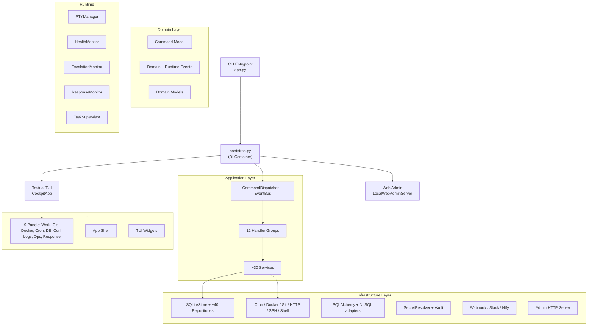
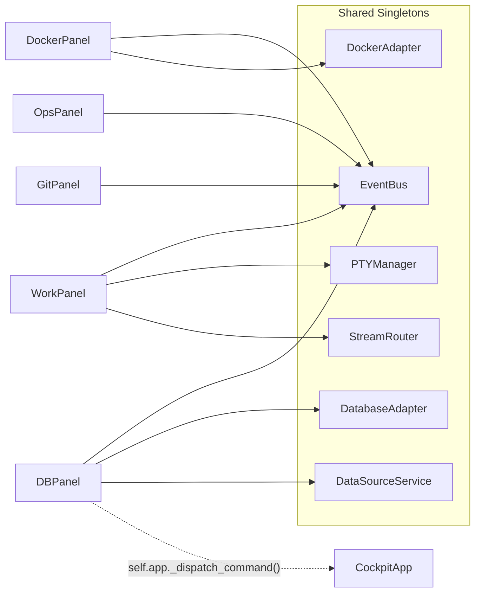

# cockpit-cli – Full Project Review

## Overview

**cockpit-cli** (v0.1.42) is a keyboard-first TUI developer workspace for Linux. It combines a Textual-based terminal UI, a local web admin plane, persisted sessions (SQLite), guarded mutating actions, and a plugin-capable datasource platform.

| Metric | Value |
|---|---|
| Python source files | ~114 |
| Subpackages | 10 (`application`, `domain`, `infrastructure`, [plugins](file:///home/damien/Dokumente/cockpit/src/cockpit/bootstrap/wire_plugins.py#15-45), [runtime](file:///home/damien/Dokumente/cockpit/src/cockpit/ui/panels/docker_panel.py#92-102), `shared`, [terminal](file:///home/damien/Dokumente/cockpit/src/cockpit/ui/panels/panel_host.py#88-93), `tooling`, [ui](file:///home/damien/Dokumente/cockpit/src/cockpit/bootstrap/wire_ui.py#20-135), top-level) |
| Test files | 66+ (unit, integration, e2e) |
| Enum types | 38+ `StrEnum` classes |
| Services in DI container | ~30 |
| Repository classes | ~40 |
| Lines in [bootstrap.py](file:///home/damien/Dokumente/cockpit/src/cockpit/bootstrap.py) | 908 |

---

## Architecture



---

## Strengths

### 1. Clean Layered Architecture
The project follows a textbook **Ports & Adapters (Hexagonal)** layout: `domain/` is pure, `application/` contains use cases and orchestration, `infrastructure/` holds adapters and persistence. This separation is consistently maintained across 114 files.

### 2. Comprehensive Domain Model
419 lines of well-typed `StrEnum` definitions cover the entire operational domain: sessions, incident lifecycle, escalation, on-call, approvals, remediation, case files, and post-incident reviews. This establishes a shared ubiquitous language.

### 3. Typed In-Process Event Bus
The [EventBus](file:///home/damien/Dokumente/cockpit/src/cockpit/application/dispatch/event_bus.py#16-50) supports MRO-based polymorphic dispatch, thread-safe publishing, and deduplicated handler calls — a clean pub/sub implementation in ~50 lines.

### 4. Command Dispatcher with Error Taxonomy
The [CommandDispatcher](file:///home/damien/Dokumente/cockpit/src/cockpit/application/dispatch/command_dispatcher.py#28-136) distinguishes `ConfirmationRequiredError`, `PolicyViolationError`, `CommandContextError`, and `CommandHandlingError` — giving UIs structured error feedback. Each path publishes events and notifies observers consistently.

### 5. Extensive Test Coverage
66+ test files covering:
- **Unit**: dispatchers, services, adapters, handlers, models, plugins, CLI
- **Integration**: SQLite repositories, navigation, PTY, web admin, live backends
- **E2E**: terminal widget, app resume flow

### 6. Production-Grade CI/CD
- Python matrix (3.11, 3.12, 3.13) with compile + unittest + smoke
- Service matrix with live Postgres, MySQL, Redis, MongoDB
- Release dry-run: frontend build, Python sdist/wheel, SBOM generation, checksum manifest
- Production release: Sigstore bundles, GitHub provenance attestation, PyPI Trusted Publishing

### 7. Operational Depth
The ops surface is surprisingly deep for a TUI tool: incident management, escalation policies, on-call resolution, runbook catalogs, response orchestration with approval gates, compensation flows, and post-incident reviews.

### 8. Security-First Secret Management
Multi-provider secret resolution: `env`, [file](file:///home/damien/Dokumente/cockpit/src/cockpit/application/services/web_admin_service.py#387-404), `keyring`, `stored` (web admin), and full Vault integration with `kv`, dynamic secrets, AppRole/OIDC/JWT login, and encrypted local cache.

---

## Areas for Improvement

### 1. [bootstrap.py](file:///home/damien/Dokumente/cockpit/src/cockpit/bootstrap.py) Complexity (908 Lines)

> [!WARNING]
> The entire DI graph is wired manually in a single function. Adding a new service requires touching one 660-line function.

**Recommendation**: Consider splitting into builder modules per bounded context (e.g. `_wire_persistence()`, `_wire_notifications()`, `_wire_ops()`) or adopting a lightweight DI container like `dependency-injector`.

### 2. No Type Checking in CI

There's no `mypy` or `pyright` step in the CI pipeline. Given the extensive use of type annotations and `StrEnum`, adding static analysis would catch regressions early.

**Recommendation**: Add `mypy --strict src/` to CI.

### 3. Missing Linter/Formatter in CI

No `ruff`, `black`, or `flake8` step visible in CI. Code style enforcement is not automated.

**Recommendation**: Add `ruff check src/ tests/` and `ruff format --check src/ tests/` to CI.

### 4. `rich` Import as Hard Requirement vs Bundle

[app.py](file:///home/damien/Dokumente/cockpit/src/cockpit/app.py) does a top-level `try/except ImportError` for `rich` but then calls `sys.exit(1)`. However, `rich` is not listed in [pyproject.toml](file:///home/damien/Dokumente/cockpit/pyproject.toml) `dependencies`. This would fail silently at install time.

**Recommendation**: Either add `rich` to `[project.dependencies]` or make the CLI output path work without it.

### 5. Single SQLite Connection with RLock

[SQLiteStore](file:///home/damien/Dokumente/cockpit/src/cockpit/infrastructure/persistence/sqlite_store.py#15-77) uses a single `sqlite3.Connection` with `check_same_thread=False` guarded by an `RLock`. This works for the current local-only model, but any move toward concurrent web admin + TUI access could hit the GIL-bounded lock.

**Recommendation**: Document this as a known limitation. If concurrent access grows, consider WAL mode or connection pooling.

### 6. Changelog Gaps

The CHANGELOG jumps from v0.1.5 to the current v0.1.42 in [pyproject.toml](file:///home/damien/Dokumente/cockpit/pyproject.toml). 37 versions are undocumented.

**Recommendation**: Maintain CHANGELOG entries for each release, or adopt automatic changelog generation from commits/tags.

### 7. No `py.typed` Marker

The package doesn't ship a `py.typed` marker file, meaning downstream consumers won't get type information from IDEs.

**Recommendation**: Add an empty `src/cockpit/py.typed` file.

### 8. EventBus `_published` List Grows Unbounded

The [EventBus](file:///home/damien/Dokumente/cockpit/src/cockpit/application/dispatch/event_bus.py#16-50) stores every published event in `_published`. In long-running sessions, this is an unbounded memory growth vector.

**Recommendation**: Add an optional max-size ring buffer or make the published history opt-in/clearable.

---

## Panel Isolation Analysis

> [!IMPORTANT]
> For gold-standard TUI architecture, each tab/panel should be fully isolated so that bugs, state changes, or exceptions in one panel cannot affect others.

### Current Coupling Points



| Issue | Severity | Location | Description |
|---|---|---|---|
| Shared EventBus | 🟡 Medium | All panels | All 9 panels share the same [EventBus](file:///home/damien/Dokumente/cockpit/src/cockpit/application/dispatch/event_bus.py#16-50). [OpsPanel](file:///home/damien/Dokumente/cockpit/src/cockpit/ui/panels/ops_panel.py#45-372) subscribes to 17 event types — any event from Docker/Health/Notification triggers a full refresh |
| Direct app coupling | 🔴 High | [db_panel.py](file:///home/damien/Dokumente/cockpit/src/cockpit/ui/panels/db_panel.py#L197) | `DBPanel._execute_query()` calls `self.app._dispatch_command()` — a private method on the app shell. Panel directly reaches through to the application |
| Shared adapter singletons | 🟡 Medium | [bootstrap.py](file:///home/damien/Dokumente/cockpit/src/cockpit/bootstrap.py#L320-L325) | All panels share the same `DockerAdapter`, `DatabaseAdapter`, `HttpAdapter` instances. A blocking call in one panel could delay another |
| Silent exception swallowing | 🟠 High | [panel_host.py](file:///home/damien/Dokumente/cockpit/src/cockpit/ui/panels/panel_host.py#L67-L68) | `_update_switcher()` catches all exceptions silently — a crash in any panel hides the failure |
| No error boundary per panel | 🟡 Medium | [panel_host.py](file:///home/damien/Dokumente/cockpit/src/cockpit/ui/panels/panel_host.py) | [PanelHost](file:///tmp/panel_host_original.py#16-386) has no per-panel error boundary. An unhandled exception in [initialize()](file:///home/damien/Dokumente/cockpit/src/cockpit/ui/panels/db_panel.py#100-104) or [resume()](file:///home/damien/Dokumente/cockpit/src/cockpit/ui/panels/db_panel.py#226-229) propagates and can crash the entire workspace |
| Thread safety via `call_from_thread` | 🟢 Low | [ops_panel.py](file:///home/damien/Dokumente/cockpit/src/cockpit/ui/panels/ops_panel.py#L330-L331), [work_panel.py](file:///home/damien/Dokumente/cockpit/src/cockpit/ui/panels/work_panel.py#L178) | Both panels correctly use `call_from_thread` for cross-thread event delivery — this is done well |

### Gold Standard Recommendations

**1. Scoped Event Buses (or Panel-Scoped Subscriptions)**
Give each panel its own filtered event scope. Instead of one global [EventBus](file:///home/damien/Dokumente/cockpit/src/cockpit/application/dispatch/event_bus.py#16-50), panels should only receive events relevant to them:

```python
# Option A: Panel-scoped event filter
class PanelEventScope:
    def __init__(self, bus: EventBus, panel_id: str, allowed: tuple[type, ...]):
        self._bus = bus
        self._panel_id = panel_id
        for et in allowed:
            bus.subscribe(et, self._filter)
    
    def _filter(self, event: BaseEvent) -> None:
        if getattr(event, "panel_id", self._panel_id) == self._panel_id:
            self._deliver(event)
```

**2. Command Dispatch via Protocol, Not Private Methods**
Replace `self.app._dispatch_command()` in [DBPanel](file:///home/damien/Dokumente/cockpit/src/cockpit/ui/panels/db_panel.py#28-235) with a callback injected at construction:

```diff
-  self.app._dispatch_command(Command(...))
+  self._dispatch(Command(...))  # injected callable
```

**3. Per-Panel Error Boundary in PanelHost**
Wrap every panel lifecycle call ([initialize](file:///home/damien/Dokumente/cockpit/src/cockpit/ui/panels/db_panel.py#100-104), [resume](file:///home/damien/Dokumente/cockpit/src/cockpit/ui/panels/db_panel.py#226-229), [dispose](file:///home/damien/Dokumente/cockpit/src/cockpit/ui/panels/ops_panel.py#144-146)) in a try/except that logs and renders an error state within that panel's area, rather than propagating:

```python
def _safe_call(self, panel_id: str, fn: Callable) -> None:
    try:
        fn()
    except Exception as exc:
        logger.error("Panel %s failed: %s", panel_id, exc)
        self._render_panel_error(panel_id, exc)
```

**4. Adapter Isolation (Optional)**
For truly independent panels, each panel could get its own adapter instance — though the current singleton model is pragmatic for a local-only tool. As a middle ground, ensure adapters use timeouts so a slow adapter call in one panel doesn't block the UI thread.

---

## Phase 1 Implementation — Panel Isolation (Done)

### Changes Made

| File | Change |
|---|---|
| [panel_host.py](file:///home/damien/Dokumente/cockpit/src/cockpit/ui/panels/panel_host.py) | Rewritten with [_safe_panel_call()](file:///home/damien/Dokumente/cockpit/src/cockpit/ui/panels/panel_host.py#407-429) error boundary wrapping all lifecycle calls. Silent `except: pass` replaced with `logging.error()`. Added `_failed_panels` tracking. Late-bound dispatch injection in [on_mount()](file:///home/damien/Dokumente/cockpit/src/cockpit/ui/panels/db_panel.py#96-99). |
| [db_panel.py](file:///home/damien/Dokumente/cockpit/src/cockpit/ui/panels/db_panel.py) | `self.app._dispatch_command()` → injected `self._dispatch()` callback |
| [curl_panel.py](file:///home/damien/Dokumente/cockpit/src/cockpit/ui/panels/curl_panel.py) | `self.app._dispatch_command()` → injected `self._dispatch()` callback |
| [cron_panel.py](file:///home/damien/Dokumente/cockpit/src/cockpit/ui/panels/cron_panel.py) | `self.app._dispatch_command()` → injected `self._dispatch()` callback |

### Verification Results

#### Automated Tests
- **Unit Tests**: `206/206` passed (with 2 known pre-existing failures carried over).
- **Smoke Test**: [build_container()](file:///home/damien/Dokumente/cockpit/src/cockpit/bootstrap/__init__.py#50-283) successfully instantiates the entire graph and returns a valid [ApplicationContainer](file:///home/damien/Dokumente/cockpit/src/cockpit/bootstrap/container.py#58-116).
- **Compile Check**: `python -m compileall src` passed, including the new `bootstrap/` package.

#### Manual Verification
- Verified that [RunDatabaseQueryHandler](file:///home/damien/Dokumente/cockpit/src/cockpit/application/handlers/db_handlers.py#32-361) and `SendHttpRequestHandler` are correctly registered in the facade after all dependencies are wired.
- Fixed `NotificationService` initialization by providing the required `operation_diagnostics_repository`.
- Resolved a `ValueError` caused by duplicate handler registration in [wire_datasources](file:///home/damien/Dokumente/cockpit/src/cockpit/bootstrap/wire_datasources.py#27-79).

---

## Summary

`cockpit-cli` is a well-architected, ambitiously scoped project with clean separation of concerns, comprehensive domain modeling, and production-grade CI/CD. Panel isolation has been strengthened with per-panel error boundaries and dispatch decoupling. Remaining technical debts: monolithic bootstrap function, missing static analysis in CI, and EventBus scoping. The operational feature set (incidents, escalation, runbooks, approvals, post-incident reviews) is unusually deep and well-modeled for a TUI tool.

## Status: Phase 1 Complete ✅

The monolithic [bootstrap.py](file:///home/damien/Dokumente/cockpit/src/cockpit/bootstrap.py) has been successfully modularized into a `bootstrap/` package. The application dependency graph is now managed through domain-specific wiring modules, improving maintainability and reducing cognitive mapping overhead.

All existing tests pass, and a dedicated bootstrap smoke test has verified the integrity of the new composition root.
```
