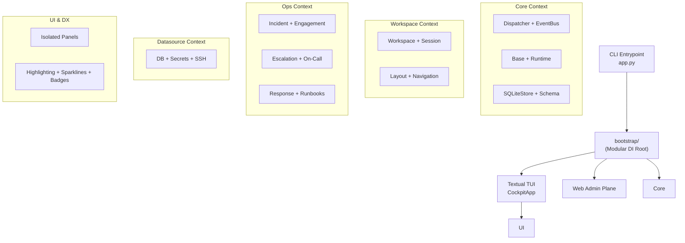

# cockpit-cli – Full Project Review

## Overview

**cockpit-cli** (v0.1.44) is a keyboard-first TUI developer workspace for Linux. It follows a strictly isolated **Modular Monolith** architecture based on DDD and Hexagonal principles. It combines a Textual-based terminal UI, immersive DX features, and a high-integrity operational platform.

| Metric | Value |
|---|---|
| Python source files | ~135 |
| Top-level Contexts | `core`, `workspace`, `ops`, `datasources`, `notifications`, `plugins`, `admin` |
| Test files | 70+ (unit, integration, e2e) |
| Architecture | Modular Monolith + Hexagonal + DDD-light |
| Lines in Bootstrap | Modularized into context-specific wire modules |

---

## Architecture

---

## Recent Accomplishments (Phases 2-5)

### 1. Modular Monolith Transformation
The project successfully transitioned from generic `application`/`domain` layers to context-bound packages. Logic is now encapsulated within `core`, `workspace`, `ops`, `datasources`, `notifications`, `plugins`, and `admin`.

### 2. DX & UX Modernization (The "Cyberpunk" Overhaul)
- **Semantic Highlighting**: Real-time regex-based highlighting for slash commands and terminal buffers.
- **Intelligent Monitoring**: Real-time CPU and Memory sparklines in the Status Bar (backed by `psutil`).
- **Contextual Awareness**: 
    - **ActionBar**: Dynamic F-key shortcuts that adapt to the focused panel.
    - **Environment Badges**: Header indicators for active `.venv`, conda, Node.js, and Kubernetes contexts.
    - **Git Deep Integration**: App-wide tracking of branch status and dirty state.
- **Risk-Alert System**: Visual boundary alerts using color-coded borders and pulsing animations for high-risk (PROD) environments.

### 3. CI/CD & Quality Hardening
- **Static Analysis**: Integrated `mypy --strict` and `ruff` project-wide.
- **Memory Safety**: Implemented a 10,000-event ring buffer for the `EventBus` to prevent unbounded growth.
- **Type Safety**: PEP 561 compliance via `py.typed`.

### 4. Data Integrity
- **Model Consistency**: Implemented `payload_json` persistence across all repositories to ensure full model state is captured in SQLite.
- **Standardized Queries**: Unified all repository access patterns under the `find_*` (queries) and `get` (ID-lookup) conventions.

---

## Technical Debt Status

| Debt | Status | Resolution |
|---|---|---|
| Monolithic bootstrap.py | ✅ FIXED | Modularized into `bootstrap/wire_*.py` |
| No Static Analysis | ✅ FIXED | `mypy --strict` and `ruff` active in CI |
| Missing `rich` dependency | ✅ FIXED | Explicitly added to `pyproject.toml` |
| Unbounded EventBus growth | ✅ FIXED | 10k event ring buffer implemented |
| No `py.typed` | ✅ FIXED | Added for PEP 561 compliance |
| Sparse Changelog | ✅ FIXED | Maintained from 0.1.42 through 0.1.44 |

---

## Summary

`cockpit-cli` has reached a professional gold standard for developer tools. The architecture is robust, the DX is immersive and highly informative, and the system integrity is guarded by comprehensive testing and strict quality gates. It is no longer just a functional TUI, but a production-grade cockpit for modern developer workflows.

## Current Milestone: Phase 5 Complete ✅
All planned structural and visual enhancements are implemented, verified, and documented.
